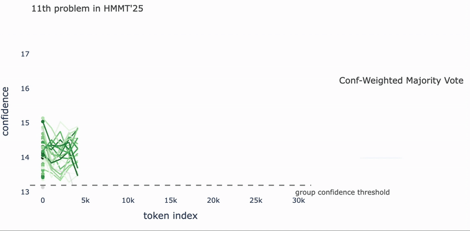
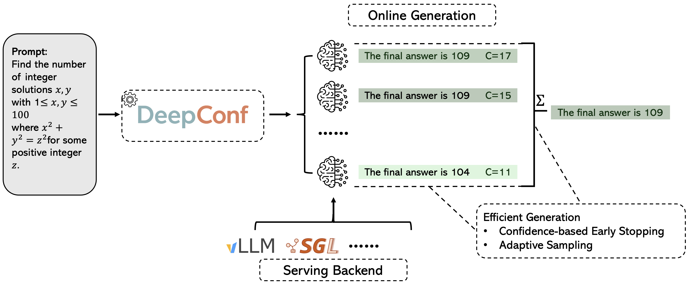

<div align="center">
    <div>
        
    </div>
    <h1>Deep Think with Confidence</h1>
    <em>Efficient Parallel Thinking Framework for Enhanced Reasoning</em>
</div>

<div align="center" style="line-height: 1; margin-bottom: 12px;">
    <br/>
    | <a href="https://jiaweizzhao.github.io/deepconf/">📝 Website</a> 
    | <a href="https://arxiv.org/abs/2508.15260">📄 Paper</a> 
    | <a href="https://x.com/jiawzhao/status/1958982524333678877">🐦 Twitter/X</a>
    | <a href="#quick-start">🚀 Quick Start</a> 
    |
    <br/>
    
    
    
    <br/>
    
</div>

  

DeepConf is an efficient parallel thinking framework built upon popular LLM serving backends such as `vLLM`. It supports various types of reasoning tasks, including math, science, and coding. The package includes standard parallel thinking pipeline with different voting and aggregation strategies, as well as efficient techniques such as confidence-based early stopping.


<div align="center">
    
</div>


## Quick Start

### Installation

```bash
pip install deepconf
uv pip install -r requirements.txt
```

### Basic Usage

```python
from deepconf import DeepThinkLLM

# Initialize model
deep_llm = DeepThinkLLM(model="deepseek-ai/DeepSeek-R1-0528-Qwen3-8B")

# Prepare prompt
question = "What is the square root of 144?"

messages = [
    {"role": "user", "content": question}
]
    
prompt = tokenizer.apply_chat_template(
    messages,
    tokenize=False,
    add_generation_prompt=True
)

# Run offline mode with multiple voting
result = deep_llm.deepthink(
    prompt=prompt,
    mode="offline",
    budget=64,
    compute_multiple_voting=True
)

# Evaluate results
for method, method_result in result.voting_results.items():
    if method_result and method_result.get('answer'):
        print(f"{method}: {method_result['answer']}")
```


## `DeepThinkLLM` Class

`DeepThinkLLM` is a lightweight wrapper around **vLLM** that extends standard generation with *deep thinking* capabilities.
It supports two main methods:

* **`generate()`** – standard text generation (same as vLLM).
* **`deepthink()`** – enhanced reasoning with confidence-based methods and voting strategies.

**Inputs**

* `model`: model path or name (e.g. `deepseek-ai/DeepSeek-R1-0528-Qwen3-8B`)
* `**vllm_kwargs`: all standard vLLM initialization parameters are supported, such as

  * `enable_prefix_caching=True`
  * `tensor_parallel_size=...`

This makes it fully compatible with vLLM while adding reasoning-specific extensions.


## `deepthink()` Function

The `deepthink()` method is the central interface for confidence-based reasoning.
It takes a **prompt**, optional **sampling parameters**, and a **mode**, with different arguments depending on the mode:

* **Online Mode (Confidence-Based)**
  Establishes thresholds with warmup traces and applies **early stopping**.

  * `warmup_traces`: number of calibration runs
  * `total_budget`: maximum number of traces

  ```python
  result = deep_llm.deepthink(
      prompt=prompt,
      mode="online",
      warmup_traces=16,
      total_budget=256,
      sampling_params=sampling_params
  )
  ```

* **Offline Mode (Batch Generation)**
  Generates all traces at once and applies multiple voting strategies.

  * `budget`: number of traces
  * `compute_multiple_voting`: enable all voting methods

  ```python
  result = deep_llm.deepthink(
      prompt=prompt,
      mode="offline",
      budget=512,
      compute_multiple_voting=True,
      sampling_params=sampling_params
  )
  ```


## Output Format

The output of `deepthink()` is returned as a `DeepThinkOutput` dataclass, which organizes results and metadata:

* **Primary Results**

  * `final_answer`: final selected answer
  * `voted_answer`: answer from the default voting method

* **Voting Results**

  * `voting_results`: dictionary of answers and confidences from all voting strategies

* **Traces & Confidence**

  * `all_traces`, `warmup_traces`, `final_traces`: generated reasoning traces
  * `conf_bar`: confidence threshold (online mode only)

* **Statistics**

  * `total_traces_count`, token usage per stage
  * timing information (generation, processing, initialization)

* **Config & Metadata**

  * `config`: configuration used for this run
  * `mode`: online or offline
  * `timestamp`: run timestamp

This structure makes it easy to analyze answers, voting behavior, confidence, and efficiency in a unified way.


## Examples

### Single Question Processing with Evaluation
```python
from wrapper import DeepThinkLLM

# Load question data
question = "What is 2^10?"
ground_truth = "1024"

# Initialize and prepare
deep_llm = DeepThinkLLM(model="deepseek-ai/DeepSeek-R1-0528-Qwen3-8B")
messages = [
    {"role": "user", "content": question}
]

prompt = tokenizer.apply_chat_template(
    messages,
    tokenize=False,
    add_generation_prompt=True
)


# Run inference
result = deep_llm.deepthink(prompt=prompt, mode="offline", budget=32)

# Evaluate results
for method, method_result in result.voting_results.items():
    if method_result:
        is_correct = int(method_result['answer']) == int(ground_truth)
        print(f"{method}: {is_correct}")
```

### Confidence Analysis
```python
# Online mode with confidence analysis
result = deep_llm.deepthink(
    prompt=prompt,
    mode="online", 
    warmup_traces=16,
    total_budget=64
)

print(f"Confidence threshold: {result.conf_bar:.3f}")
print(f"Warmup traces: {len(result.warmup_traces)}")
print(f"Final traces: {len(result.final_traces)}")

# Analyze traces by confidence
above_threshold = [t for t in result.warmup_traces if t['min_conf'] >= result.conf_bar]
print(f"Traces above threshold: {len(above_threshold)}")
```

### Offline and Online Examples

see examples folder for more detailed examples.

## Citation

```
@article{fu2025deep,
  title={Deep think with confidence},
  author={Fu, Yichao and Wang, Xuewei and Tian, Yuandong and Zhao, Jiawei},
  journal={arXiv preprint arXiv:2508.15260},
  year={2025}
}
```
